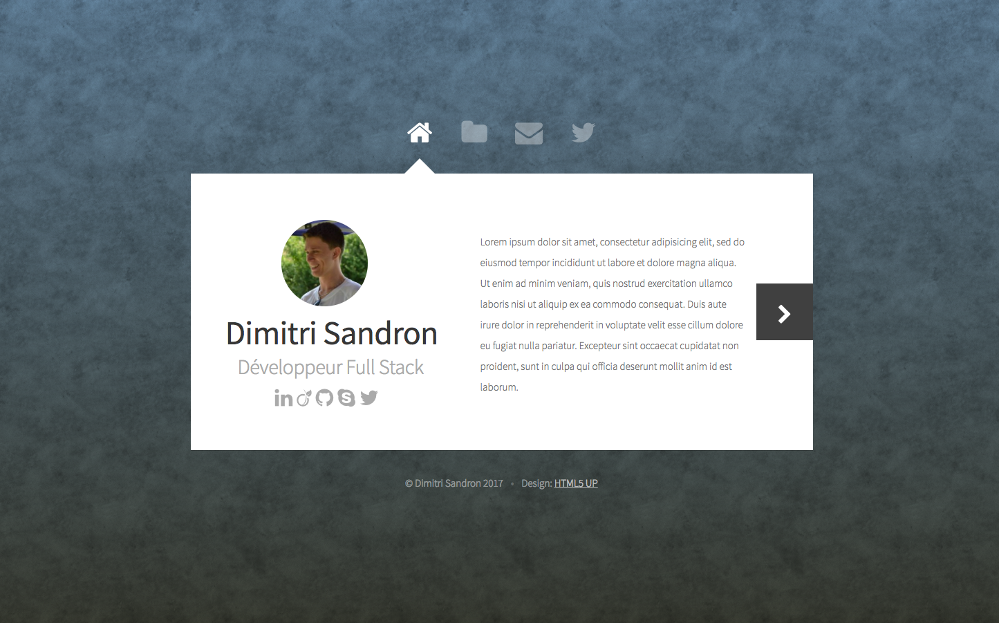

# Portofolio perso.
- Affichage du portfolio à l'index du site http://dimitrisandron.fr

## Fonctionnalités
- Présentation de mon parcours
- Présentation de mes projets réalisés (avec liens GitHub)
- Formulaire de contact

## About
- Framework Laravel
- HTML, CSS, Javascript
- Thême HTML5 UP https://html5up.net/astral
- © **Dimitri Sandron** - _Mai 2017_

### Restants à faire
- Créer un projet laravel
- Inclure le contenu du dossier du theme dans le projet Laravel
- Trouver un theme backoffice
- Créer système authentification pour administration
- Modéliser base de données
- Créer tous les onglets sur BO

#### FO :
✓ Changer le fond
- Page "A propos de moi"
	✓ Photo (en rond)
	- Présentation rapide
	- Liens réseaux sociaux entreprises
	- Parcours (presentation rapide, en gras dans un paragraphe)
- Page "Mes travaux"
	- Boucle foreach sur les projets
	- Détail à afficher dans un déroulement en dessous de l'image aperçu du projet (gérer ocpacités)

#### BO :
- Modification contenu page "A propos de moi" > Présentation + photo de profil
- Gestion des projets (ajouts, édition, suppression)
- Stockage des messages de contact
- Modification des autres infos du site (liens réseaux sociaux, ...)

### Améliorations possibles
n/a

### Liens utiles
- https://galactic.ink/bg/
- https://tympanus.net/

